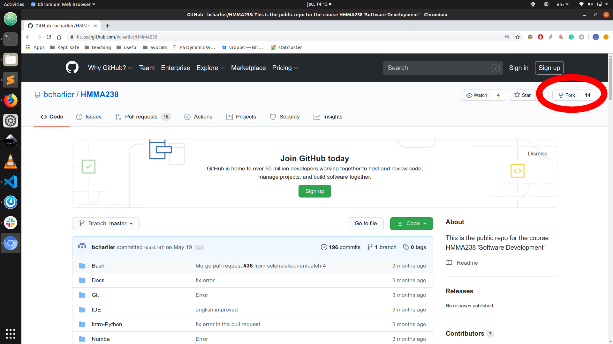
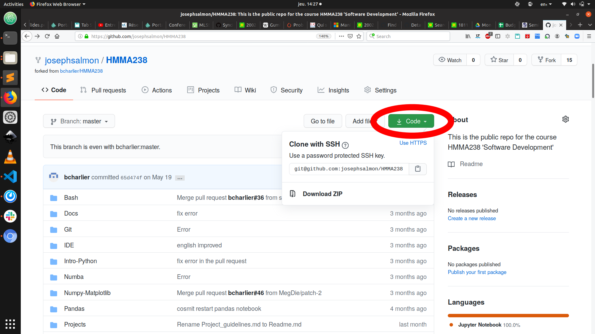

# Bonus
2 supplementary points on the final grade of the course can be obtained for contributions improving the course material (notebooks, Readme, etc.) under the following constraints.


## Bonus conditions

- only 1 point is given for a contribution,
- only the first contribution proposed on a theme is rewarded (no point given for followers!),
- documented pull-requests, or PR, (the details could be found below) are expected : details are expected to help judging what the proposition improves/corrects.
- For typos PR at least 5 corrections are expected to receive 1 point (5 PR with one typos will not be rewarded).
- The maximum bonus is 2 point per student.

## Pull Request (PR)
The pull request system is a standard way of proposing improvement and modifications in open source project. Here we use it for the opportunity to improve the course material.

The principle is the following

- Fork: Connect to your Github account (see [tp.md](tp.md) for details) and fork the repository by clicking on the "Fork" icon:


- Go to on your Github account and find the HMMA238 repository. In what follows you should substitute my_github_id by your github identification; in the screenshots the examples are with **my_github_id=josephsalmon** and they should be adapted according to yours.
The url is hence https://github.com/my_github_id/HMMA238 

- Get the cloning repository by clicking the "clone" button and choose either the `https` or `ssh` protocol (the later being recommended to avoid typing your password at each git pull/push):   .

- Clone the repository on your local machine. On Linux this consists in typing the following line in a terminal:

```bash
$ git clone git@github.com:my_github_id/HMMA238.git
```

- Adding a remote : you need to configure a remote that points to the upstream repository. Before you can sync your fork with an upstream repository, you must do this step 

```git remote add upstream https://github.com/bcharlier/HMMA238.git```

- you can check the remote available (yours and the class one) by typing:

```bash
$ git remote -v
```

- Create a new branch for instance called `improving_git`, and move to it

```bash
$ git checkout -b improving_git
```

- Make local edit on some of the files in the project, and then commit and push the new branch `improving_git`:

```bash
$ git commit -am "I edited some typos"
$ git push --set-upstream origin improving_git
```


- Create Pull Request: go back in your browser to https://github.com/my_github_id/HMMA238 and click on Pull Request.


- To keep your fork up to date / sync:

```bash
$ git fetch upstream
```

- To come back to the `master` branch:

```bash
$ git checkout master
```

- To merge the upstream version (the one you see at https://github.com/bcharlier/HMMA238.git)

```bash 
$ git merge upstream/master
```


## Additional material

- for PR: https://help.github.com/en/github/collaborating-with-issues-and-pull-requests/creating-a-pull-request-from-a-fork
and 
https://www.wikihow.com/Create-a-Pull-Request-on-Github


- for synchronization of your fork with the (course) master:
https://help.github.com/en/github/collaborating-with-issues-and-pull-requests/syncing-a-fork
